# CPhotos
CPhotos: A Local Replacement for the GPhotos (Google Photos) cloud archival service that you control.  With compression and optimization to JPEG &amp; H.265 HEVC MP4. (TODO: Experiment with AV1 codec)

### SyncThing and Managing Your Own Local Google Photos-esque Sync Service (CPhotos)

The point of this service is to completely replace Google Photos functionality with something I am in complete control over.
The main features I want to keep from GPhotos are:

1. Can sync videos and images from my Android phone whenever I'm on my WiFi / same network as my SyncThing fileserver (automatic? perhaps. I'll be happy with manual - so that I know when I can "clear" my photos to make space on the phone and not worry about having to indicate in the photo list somehow)
2. Once photos have been sync'd to the fileserver and are on a hard drive, a periodic cron job will go through the sync folder and perform the following tasks:
3. Recompress / optimize and shrink (in the best order to achieve optimum results) each image file for archival (scan will recognize already processed photos and skip them so processed files can stay in place - probably by dimensions and / or file size)
4. Transcode (and shrink if above a threshold) each video file aggressively with H.265 and 2-pass to really shrink video files (scan will recognize videos already encoded with H.265 and skip them so processed files can stay in place)
5. SyncThing should be set up to sync only in one direction, from the phone to the fileserver, and deletes should be ignored completely.  Changes on the fileserver to the images should also not trigger a resync from the phone, allowing me to safely delete from the phone whenever I confirm the sync is up to date
6. Ensure that the image and video processing... uh, process... doesn't affect the original file creation date, so that photos and videos will still show up in the proper order on their correct dates when they were taken -- not when they were compressed (this may not be possible, so at least the filename still has a timestamp included somewhere)
7. OK, so when photos are dumped into the sync folder this may need to be somewhere temporary / incoming / not on a redundant part of a backup drive yet.  Then, the processing script notices new files in there (or checks every so often and notices), and shrinks / recompresses / transcodes the files to another folder named after the current year (2021) on a redundant part of a backup drive.  This way the incoming files won't be duplicated before they are processed.
8. Then perhaps before I clear photos / videos on my phone, first I check the sync status to make sure they all sync'd to the incoming folder, then I check the "incoming" folder to make sure it's empty, then I safely can delete the photos on my phone - knowing they are now safely on a redundant drive (perhaps I should also initiate the redundant sync before considering them "safe")
9. Google Motion Photos should also be supported; these poorly-named `MVIMG_*.jpg` files are not actually jpeg images, but contain an `mp4` video.  CPhotos should extract this `mp4` video and then compress it to h265 and remove the source `MVIMG_*.jpg` files once confirmed complete.
  
  
To process a single Google Motion Photo file, you can manually execute the following command to extract the `.mp4` and `.jpg` potentially contained inside.  Most times, I find there is only an `.mp4` - this is from my Pixel and Pixel 3's Google Motion Photos taken back in 2019.
```
googlemotionphotoextract.sh MVIMG_xxxxx_yyyyy.jpg
```

Install Syncthing following their website instructions: https://syncthing.net/downloads/#debian--ubuntu-packages, then here is a handy link with further instructions to install the Syncthing systemd service so it autostarts upon boot:
https://docs.syncthing.net/users/autostart.html#linux 
The Github location of the systemd files is here: https://github.com/syncthing/syncthing/tree/main/etc/linux-systemd
...here, to download to the Pi and install the service, type:
```
wget https://raw.githubusercontent.com/syncthing/syncthing/main/etc/linux-systemd/system/syncthing%40.service
sudo cp syncthing@.service /etc/systemd/system/
sudo systemctl enable syncthing@pi.service
sudo systemctl start syncthing@pi.service
```

Now, if you're like me (or if you are me...!), you'll want to disable this syncthing service and manually start it up in `rc.local` after the USB drives are all sequenced and mounted and linked, or your syncthing service will complain about folder paths missing.  See the included `reference/rc.local` for how I do this.

Building `mozjpeg` on a Raspberry Pi 4 is not documented directly anywhere I could find, but I think I got it working thusly:
```
sudo apt-get -y install build-essential autoconf pkg-config nasm libtool cmake zlib1g-dev libpng-dev
git clone https://github.com/mozilla/mozjpeg.git
cd mozjpeg
cmake -G"Unix Makefiles"
make
sudo make install
cd ..
```

Then we can build the `jpeg-archive` toolset, (also not directly documented for install on a Raspberry Pi 4) which depends on `mozjpeg` above, thusly:
```
git clone https://github.com/danielgtaylor/jpeg-archive.git
sudo ln -s /opt/mozjpeg/lib32/ /opt/mozjpeg/lib
cd jpeg-archive
make
sudo make install
cd ..
```

Installing `ffmpeg` on a Raspberry Pi 4 is easy:
```
sudo apt-get install -y ffmpeg
```

Then you (or I!) can take advantage of my handy media processing scripts, meant to automatically take incoming photos and videos from a phone sync and:
1) Optimize and shrink any JPEG imagery to HD sizes
2) Shrink any non-JPEG, non-GIF imagery to HD sizes
3) Transcode and shrink any video files to HD sizes with h.265 compression CRF 34 (as I've found to be quite suitable for Google Photos-esque levels of archival quality, actually quite a bit better and smaller)
4) Detect timestamps in the filename of each original media file for more accurate dating - and if one is not found, fallback to extracting the year from the Creation Date. (Use the full timestamp including date & time or many randomly-named files will match the datestamp and go to strange folders)
5) Use the year detected in step 4 to organize all media into year subfolders for easier management, such as `targetFolder/2020` and `targetFolder/2021`
6) Additionally, for subfolders in the `sourceFolder`, they will be treated each as their own archive folder, each main subfolder retained and flattened down to year folders inside each -- for example: `sourceFolder/Reddit/image1.jpg` would now be archived in `targetFolder/Reddit/2021/image1.jpg`
7) The original media files will be deleted once they each have been successfully processed and the target archive file is confirmed to exist 
8) Any undefined / unrecognized types of files will simply be *ignored*.
9) The output folder of the FFMPEG should be a temporary folder, preferably on a RAMdisk, and only once the transcode is complete should it write the full output file to the target folder.
10) The temp / working folder of the image processing should be a RAMdisk as well.
11) If the image processing ends up without an image at the target site, should default to just copying it over (Usually resulting from the "New size is larger then old size" error condition anyway) so that we don't miss archiving any media.

This is the script to process a folder:

```
processmediafolderforarchive.sh sourceFolder targetFolder
```

...I also wanted to ensure that all the transcoding / temp work was being done in a RAMdisk, as my Raspberry Pi 4 has 8GB of RAM that I do not fully use.  I dedicated 1.5GB to a RAMdrive.  I also uninstalled the swapfile first, and created the ramdisk folder:
```
sudo dphys-swapfile swapoff && sudo dphys-swapfile uninstall && sudo update-rc.d dphys-swapfile remove && sudo systemctl disable dphys-swapfile
sudo mkdir /ramdisk
```

I edited the `/etc/fstab` file to enable the RAMdisk every bootup:
```
sudo nano /etc/fstab
```
...to contain the following entry for the RAMdisk:
```
transcode /ramdisk tmpfs size=1500M,noatime,nodev,nosuid,noexec,nodiratime 0 0
```

...After a restart, the ramdisk will be available.  

The plan is to have the processing occur while the current folder is the ramdisk.  The current folder during execution is where the transcoding temp file is created.  We also want to utilize this temp space to process Google Motion Photos as they simply do not like being processed on a remote drive, so we will copy these to the ramdisk and then extract the `.mp4` and `.jpg` if available, then move them to the final destination and remove the source once we confirm the extracted target(s) exist. 


...and, if you'd like to just have this GPhotos-esque service (I like to call mine "CPhotos") always running as a systemd service, then I've worked out an example of exactly how to do that.  My example uses my customized `processmymediafoldersforarchive.sh` script, which runs through a list of specific syncs and target archival folders for my fileserver, and can be found as `reference/cphotos.service`.
If you'd like to install this service, customize the `cphotos.service` file and then:
```
sudo cp cphotos.service /etc/systemd/system/
sudo systemctl enable cphotos.service
sudo systemctl start cphotos.service
```

....however, if you're like me (or are me!) - then you probably want to sequence this service's startup time to after the USB drives are all mounted and linked properly.  In this case, see the `reference/rc.local` instead of using the `enable` command above.


See link 8 below for details on how to have Syncthing auto run this script after sync and BAM!  Google Photos service at home that YOU control!  
Edit: OK, so Syncthing doesn't yet have this feature.  So we'll create a simple service instead; see links 9 - 12.
  
Links:
1. https://syncthing.net/ 
2. https://linuxconfig.org/batch-image-resize-using-linux-command-line
3. https://guides.wp-bullet.com/batch-resize-images-using-linux-command-line-and-imagemagick/
4. https://guides.wp-bullet.com/batch-compress-jpeg-images-lossless-linux-command-line/
5. https://guides.wp-bullet.com/batch-optimize-jpg-lossy-linux-command-line-with-jpeg-recompress/
6. https://openbase.com/js/mozjpeg
7. https://geoffruddock.com/bulk-compress-videos-x265-with-ffmpeg/
8. https://github.com/syncthing/syncthing/issues/5601 (Syncthing how to auto run script after sync)
9. https://www.shubhamdipt.com/blog/how-to-create-a-systemd-service-in-linux/
10. https://www.linux.com/topic/desktop/systemd-services-monitoring-files-and-directories/
11. https://gist.github.com/fcangialosi/45701b95f7436049a6390fecf3c9b8a1
12. https://bartsimons.me/sync-folders-and-files-on-linux-with-rsync-and-inotify/
13. https://github.com/cliveontoast/GoMoPho

If you access the SyncThing folders at all from a Mac / OSX, you will get all sorts of "locally changed files" if you don't ignore the following pattern for each sync folder: 
```
(?d).DS_Store
(?d)._*
```

###### Repairing damaged MP4 files with missing `moov atom`s:
Need to compile tool `untrunc` as well as a "reference" MP4 file recorded by the same device / camera app with the same settings to pull a good `moov atom` from:
```
sudo apt-get -y install libavformat-dev libavcodec-dev libavutil-dev
git clone https://github.com/ponchio/untrunc.git
pushd untrunc
wget https://github.com/libav/libav/archive/v12.3.zip -O libav-12.3.zip
unzip libav-12.3.zip
pushd libav-12.3
./configure
make
popd
g++ -o untrunc -I./libav-12.3 file.cpp main.cpp track.cpp atom.cpp codec_*.cpp codecstats.cpp codec.cpp mp4.cpp log.cpp -L./libav-12.3/libavformat -lavformat -L./libav-12.3/libavcodec -lavcodec -L./libav-12.3/libavresample -lavresample -L./libav-12.3/libavutil -lavutil -lpthread -lz
sudo cp untrunc /usr/local/bin/
popd
```

Then, you can use the included script `videofixmoovatom.sh` as such:
```
videofixmoovatom.sh "damaged.mp4" "known_good_reference.mp4"
```


###### Links:
1. https://itectec.com/superuser/how-to-open-and-repair-an-m4v-or-mp4-video-file/
2. https://github.com/ponchio/untrunc

##### Using the `screen` utility to kick off and come back to long-running jobs over SSH
Screen will ensure the batch command keeps on running even if your SSH session is terminated.

```
sudo apt-get install screen
```

Create a new screen session

```
screen
```

Perform your long-running command (for example, kick off processing of a large folder of media files as below)

```
processmediafolderforarchive.sh sourceFolder targetFolder
```

Detach the screen with `Ctrl+A` and pressing `D` (detach).

You can use the `top` command and look for active processes once in a while.

Reattach the screen in a later SSH session like so:

```
screen -r
```


### Moving Syncthing Folders to New Drive
Shut down Syncthing, move the folder on disk (including the .stfolder marker), edit the path directly in `~/.config/syncthing/config.xml` and then start Syncthing again.


### Configuring a One-Way Phone Photo Sync
The following is how to configure a one-way phone sync for your camera photos / videos to automatically dump onto your server in an appropriate location for CPhotos to notice and process / archive automatically.

* Install the SyncThing app from the Play Store on your phone
* Launch SyncThing and run through setup wizard.  You will end up with a default "Camera" sync folder to start with
* Go to the "Devices" tab and click the plus + button in the top right to add a device
* Choose to scan QR code (QR icon next to device ID field)
* Open the SyncThing web management UI in your computer's web browser ( https://192.168.100.110:8384/# )
* In the Actions menu in the top right, click the Show Id option to show the QR code for your server device
* On your phone, scan the QR code with SyncThing to add your server device
* On your computer, in the web management UI, a message will appear saying that your new device wants to add itself to the server.  Click Add Device to bring up the Add Device dialog to configure the new device.  Give it a name and save it with default settings.
* See screenshots below documenting how to configure the phone sync folder and the server side sync folder:
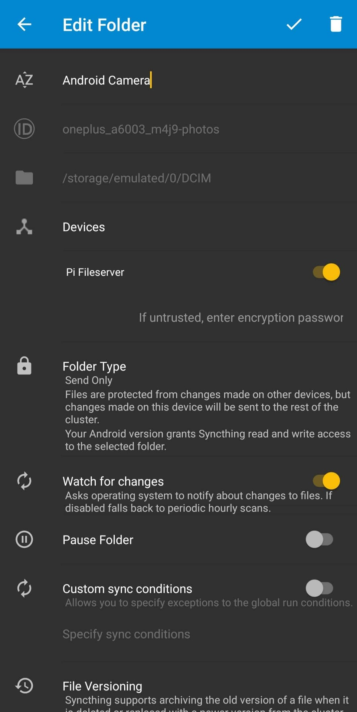

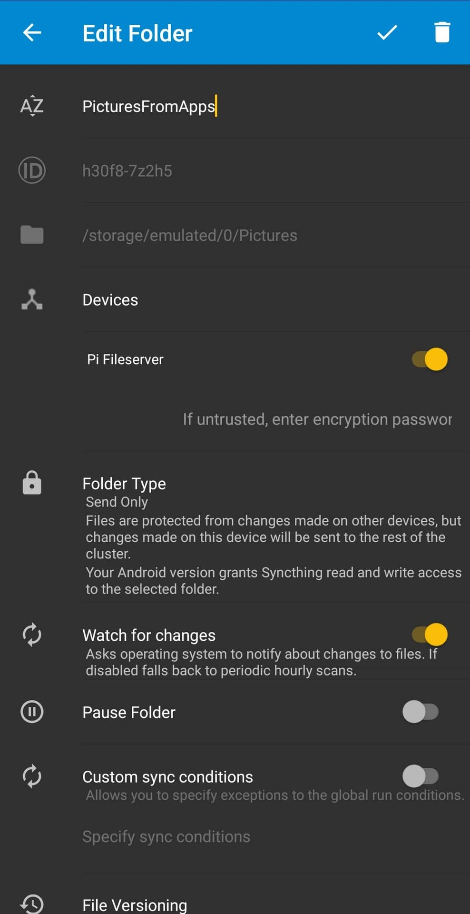

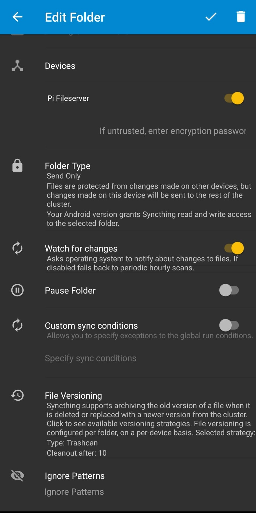

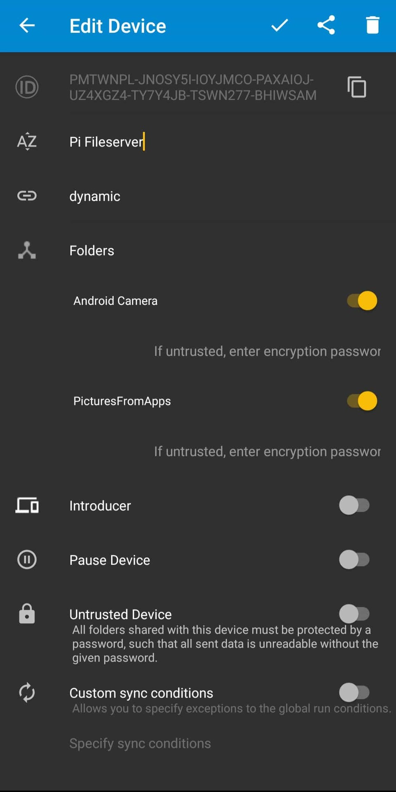

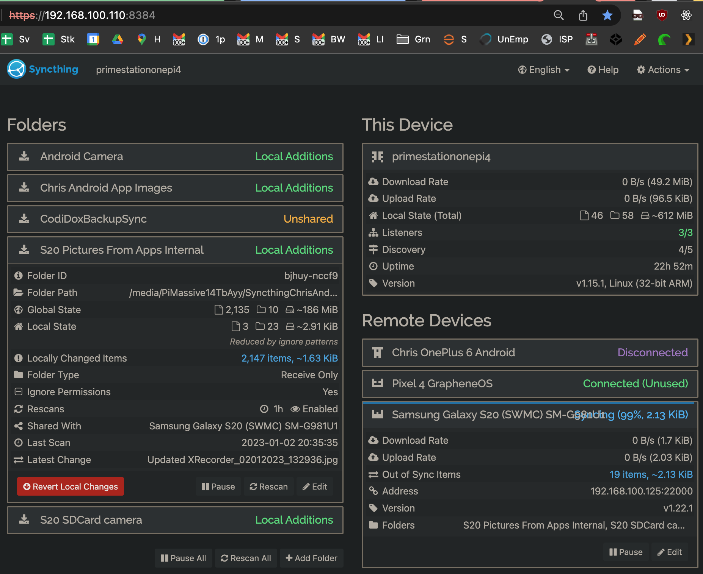

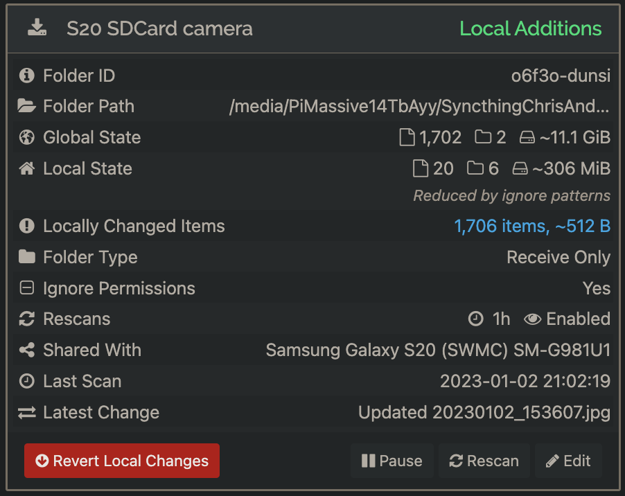

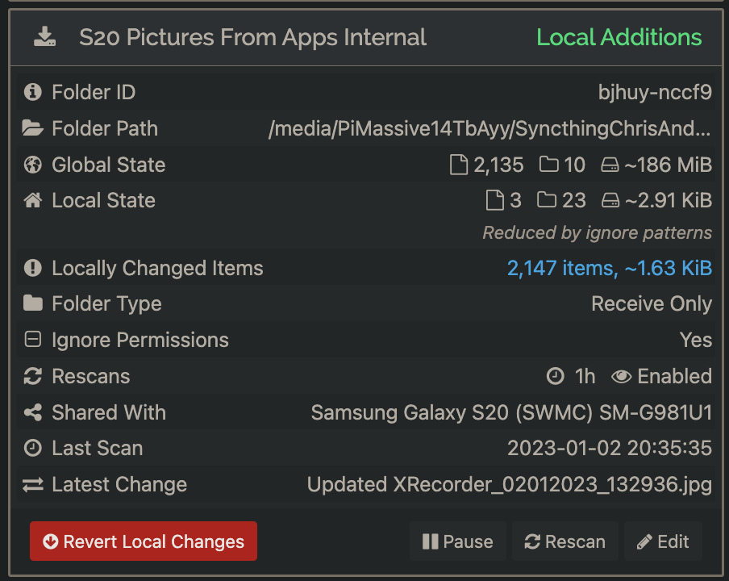

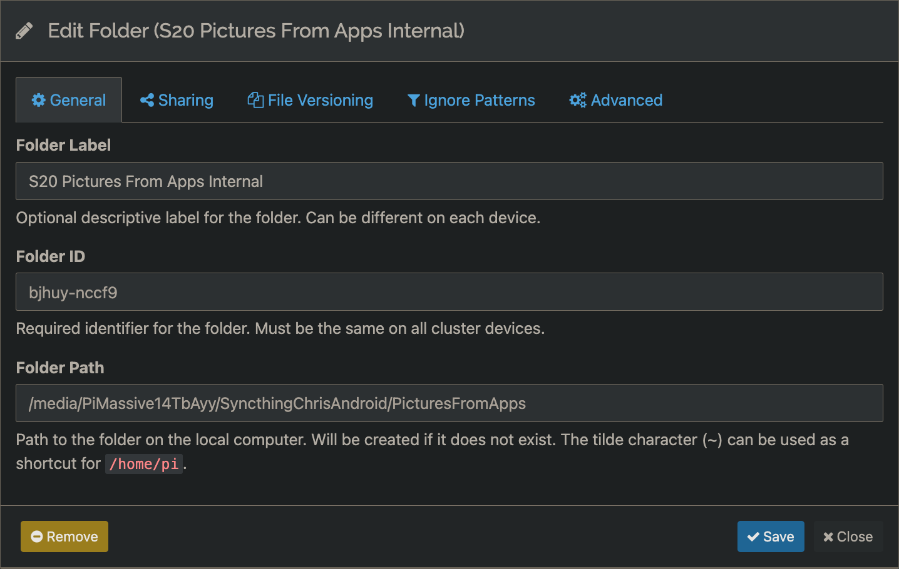

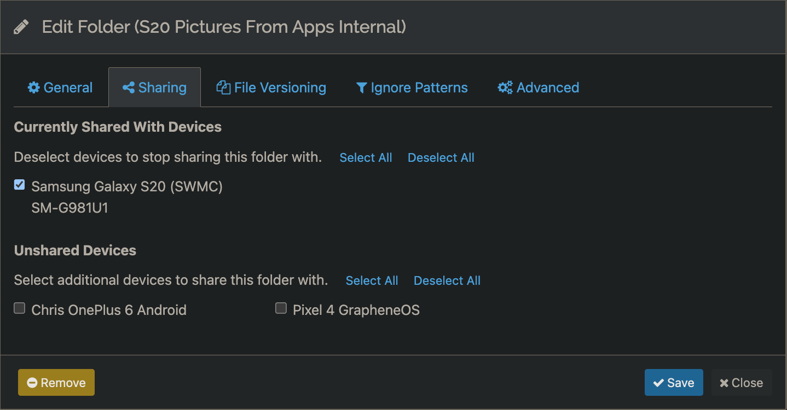

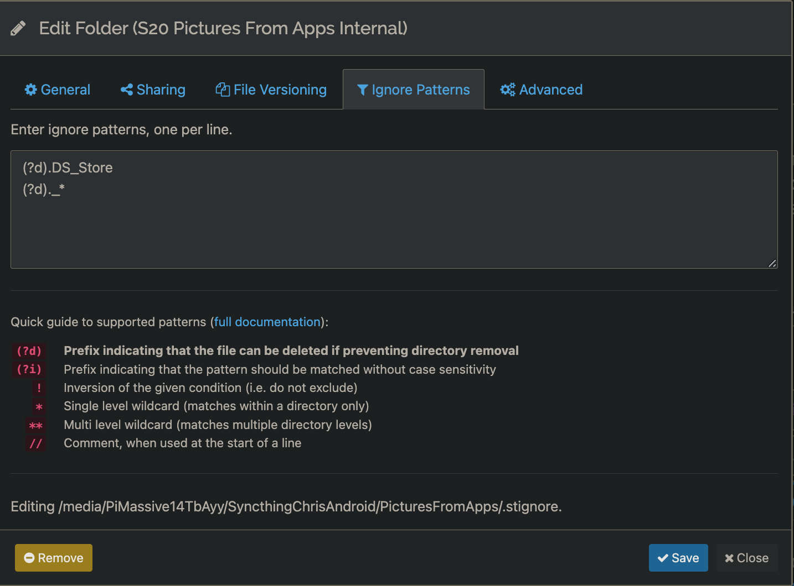

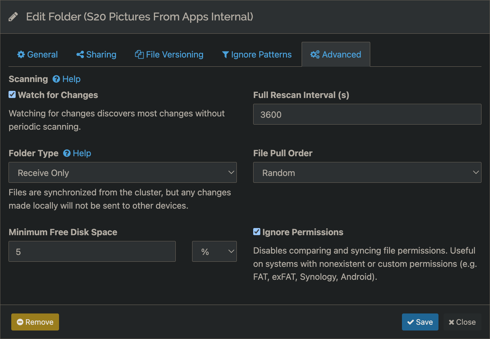


### NOTES:
My Google Photos / GPhotos downloaded media total 377GB for my collection of photos and videos I had uploaded over the course of 10-15 years.  This would have required 16 BD-R media for long-term storage.

With CPhotos, this collection shrank down to 34GB -- which fit on 2 BD-R media!


CPhotos service extracted from https://github.com/free5ty1e/debianusbfileserver/blob/master/README.md 2022.10
